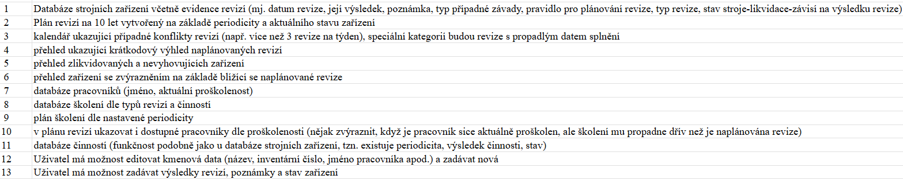

# Plán tvorby
## Specifikace požadavků

## Části aplikace
* Databáze a její API (sqlite + python/json)
* Backend aplikace (python-Eel)
* Frontend aplikace (angular)
## Náležitosti částí
### Databáze
* Typy dat: 
    * Strojní zařízení
    * Revize strojních zařízení (datum revize, její výsledek, poznámka, typ případné závady, pravidlo pro plánování revize, typ revize, stav stroje-likvidace)
    * Pracovníci (jméno, aktuální proškolenost <b>(? výčet školení/u každého školení informace T/F)</b>)
    * Školení dle typu revizí a činností (<b>? která bude hlavní informace, školení nebo revize/činnost</b>)
    * Plány revizí, školení <b>(! ukazovat dostupné pracovníky - ukládat/generovat)</b>; bude ve formě jsonu ve složce ./backend/database/plans
* API:
    * Python, knihovna sqlite3
    * Sqlite část budou funkce, které spouští SQL příkazy, main.py by neměl mít k databázi žádný přímý přístup
    * JSON část budou funkce stejným způsobem jako u sqlite, jednotlivé pro dané plány; zvaž ukládání do "backup" složky jako poslední záchrana pro uživatele
    * Soubor main.py by opět neměl přistupovat k žádným souborům přímo, pokud přibydou nové části, které je potřeba ukládat, je vždy nutno vytvořit prostředníka importovaného do main.py
* Databáze je priorita číslo 1 protože veškeré fungování je na ní závislé a je potřeba mít maximum času pro ladění její podoby
### Funkcionality
* Generování plánů (revizí, školení) a jejich načtení ze souboru <b><big>B</big></b>
* Zobrazování plánů, ukazování konfliktů v revizích a krátkodobého výhledu/blížící se revize, zářízení s možností filtrovat (zlikvidované a nevyhovující) <b><big>F</big></b>
* Editace dat strojů i pracovníků (**F** posílá na **B** jen konkrétní změny)
* Zadávání výsledků revizí, poznámek **(? odškrtávat z plánu nebo rozšiřovat plán postupně v čase)**
## Plán posloupnosti
1. Databáze **DTB**
2. Základní funkcionalita backendu **B**
    * Serving defaultního Angular frontendu
    * Poskytování dat přímo z databáze bez úprav
3. Generování plánů **B**
4. Zobrazování dat a plánů na FE a prostředí pro editace a uživatelský vstup **F**
5. Zpracování a ukládání uživatelských vstupů **B**
6. Testování a optimalizace UI
## Termíny
* 28.11. - kontrola plnění práce (vedoucí + vedení)
* 7.4. - odevzdání práce

